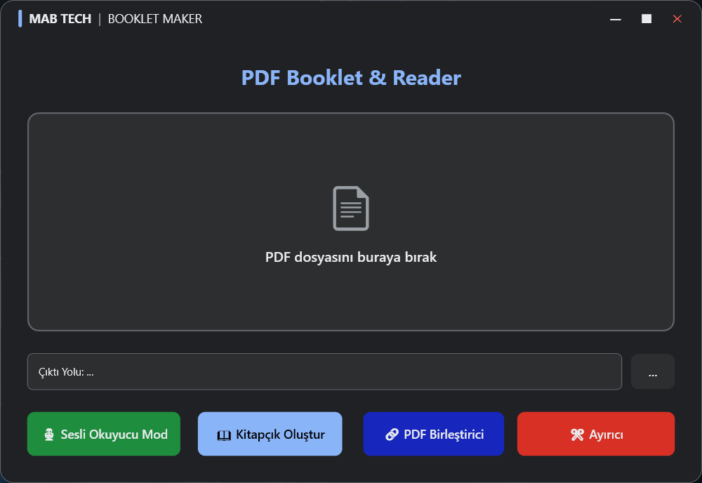
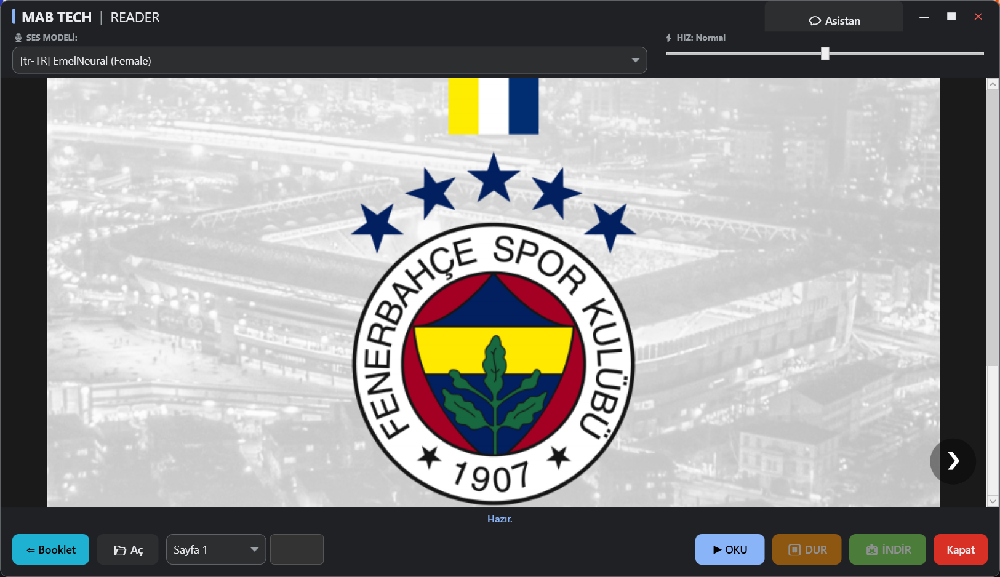
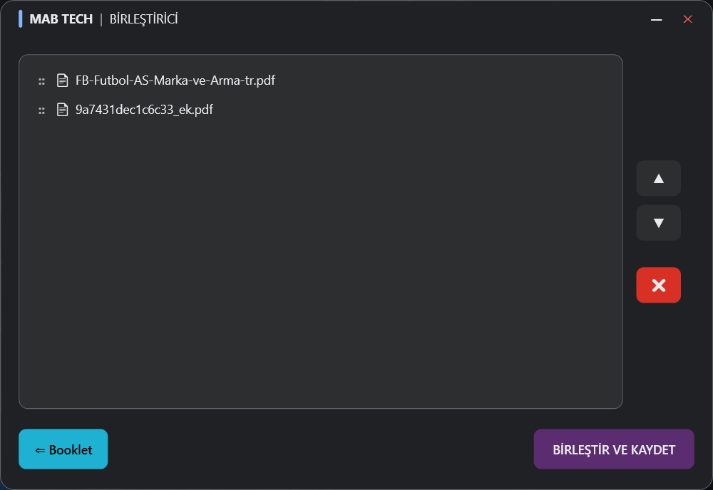
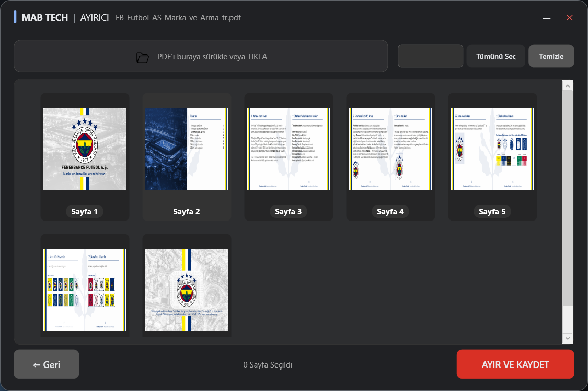

<div align="center">

# 📖 MABooklet

### PDF Booklet Maker & Reader Toolkit

[](LICENSE)
[](https://dotnet.microsoft.com/download/dotnet-framework/net472)
[](https://www.microsoft.com/windows)
[](https://learn.microsoft.com/dotnet/desktop/wpf/)
[](https://github.com/Mertcan-BZTPRK/MABooklet/releases)

**MABooklet** is an all-in-one PDF toolkit for creating print-ready booklets, reading PDFs with AI-powered text-to-speech, merging & splitting PDF files — all wrapped in a modern dark-themed WPF interface.

[🇹🇷 Türkçe](#-türkçe) · [🇬🇧 English](#-english)

</div>

---

## 🇬🇧 English

### 📥 Download & Installation

Don't want to build from source? Download the ready-to-use installer:

1. Go to the [**Releases**](https://github.com/Mertcan-BZTPRK/MABooklet/releases) page
2. Download **`MABooklet_Kurulum.exe`** from the latest release
3. Run the installer (all dependencies and engines are included automatically)
4. Click the **MABooklet** icon on your desktop and enjoy! 🎉

> 💡 No Python, no Visual Studio, no extra setup needed — just install and use.

---

### ✨ Features

| Feature | Description |
|---------|-------------|
| 📖 **Booklet Creator** | Automatically imposes PDF pages into booklet (signature) order, ready for double-sided printing and folding |
| 🎙 **PDF Reader with TTS** | Read PDFs with word-by-word highlighting and natural text-to-speech powered by Microsoft Edge TTS (100+ voices, 45+ languages) |
| 🤖 **AI Assistant** | Ask questions about your PDF content using Google Gemini AI — get summaries, explanations, and answers instantly |
| 🔗 **PDF Merger** | Combine multiple PDF files into one with drag & drop reordering |
| ✂️ **PDF Splitter** | Extract specific pages or page ranges from a PDF with visual page preview |
| 🎨 **Modern UI** | Dark-themed, borderless WPF interface with smooth animations and custom controls |

### 📸 Screenshots

> 💡 *Add screenshots to a `screenshots/` folder and uncomment the lines below:*

<!--




-->

### 🛠 Tech Stack

- **Framework:** .NET Framework 4.7.2 (WPF)
- **PDF Processing:** PDFsharp, PdfiumViewer, PdfPig
- **AI Integration:** Google Gemini API (via Python)
- **Text-to-Speech:** Microsoft Edge TTS (via Python)
- **Language:** C# + Python
- **Serialization:** Newtonsoft.Json

### 📋 Prerequisites

- **Windows 10/11**
- **.NET Framework 4.7.2** or later
- **Python 3.8+** (for building TTS and AI modules)
- **Visual Studio 2022+** (for development)

### 🚀 Getting Started

#### 1. Clone the Repository

```bash
git clone https://github.com/Mertcan-BZTPRK/MABooklet.git
cd MABooklet
```

#### 2. Restore NuGet Packages

Open `MABooklet.slnx` in Visual Studio. NuGet packages will be restored automatically on build.

Or restore manually:

```bash
nuget restore MABooklet.slnx
```

#### 3. Build Python Modules

The TTS, AI, merge, and split features use Python scripts compiled to standalone executables. To build them:

```bash
cd MABooklet/python

# Install dependencies
pip install edge-tts google-generativeai pypdf pyinstaller

# Build executables
pyinstaller --onefile tts.py
pyinstaller --onefile ai.py
pyinstaller --onefile merge.py
pyinstaller --onefile split.py

# Copy executables to the python folder
copy dist\tts.exe .
copy dist\ai.exe .
copy dist\merge.exe .
copy dist\split.exe .
```

#### 4. Build & Run

Build the solution in Visual Studio (`Ctrl+Shift+B`) and run (`F5`).

### 📁 Project Structure

```
MABooklet/
├── MABooklet.slnx                  # Solution file
├── LICENSE                         # MIT License
├── README.md                       # This file
├── .gitignore                      # Git ignore rules
│
└── MABooklet/                      # Main WPF application
    ├── MABooklet.csproj            # Project file (.NET Framework 4.7.2)
    ├── App.xaml / App.xaml.cs      # Application entry point & process cleanup
    ├── MainWindow.xaml / .cs       # Main window — PDF drop zone & navigation
    ├── ReaderWindow.xaml / .cs     # PDF reader with TTS & AI chat
    ├── MergerWindow.xaml / .cs     # PDF merger with drag & drop
    ├── SplitterWindow.xaml / .cs   # PDF splitter with visual preview
    ├── CustomAlertWindow.xaml / .cs # Custom modal dialog
    ├── DownloadRangeWindow.xaml / .cs # Page range input dialog
    ├── BookletProcessor.cs         # Booklet imposition algorithm
    ├── EdgeTtsClient.cs            # Edge TTS Python bridge
    ├── AIClient.cs                 # Gemini AI Python bridge
    ├── Images/                     # Application icons
    └── python/                     # Python modules
        ├── tts.py                  # Text-to-Speech engine (Edge TTS)
        ├── ai.py                   # AI assistant (Google Gemini)
        ├── merge.py                # PDF merge utility
        └── split.py                # PDF split utility
```

### 🔧 How It Works

#### Booklet Imposition
The `BookletProcessor` calculates the correct page order for saddle-stitch booklet printing. It rearranges pages so that when printed double-sided and folded, they appear in the correct reading order.

#### TTS Engine
The application communicates with a Python-based Edge TTS engine via process execution. It supports 100+ neural voices, adjustable speed, and provides word-level timing data for synchronized highlighting.

#### AI Assistant
PDF text is extracted and sent to Google Gemini API through a Python bridge. Supports both short and detailed response modes with Markdown formatting.

### 🤝 Contributing

Contributions are welcome! Feel free to:

1. **Fork** the repository
2. **Create** a feature branch (`git checkout -b feature/amazing-feature`)
3. **Commit** your changes (`git commit -m 'Add amazing feature'`)
4. **Push** to the branch (`git push origin feature/amazing-feature`)
5. **Open** a Pull Request

### 📄 License

This project is licensed under the **MIT License** — see the [LICENSE](LICENSE) file for details.

---

## 🇹🇷 Türkçe

### 📥 Kurulum & İndirme

Kaynak koddan derlemekle uğraşmak istemiyorsanız, doğrudan kurulabilir versiyonu indirebilirsiniz:

1. [**Releases**](https://github.com/Mertcan-BZTPRK/MABooklet/releases) sayfasına gidin
2. Son sürümdeki **`MABooklet_Kurulum.exe`** dosyasını indirin
3. Kurulumu çalıştırın (tüm bağımlılıklar ve motorlar otomatik olarak kurulacaktır)
4. Masaüstündeki **MABooklet** simgesine tıklayarak keyfini çıkarın! 🎉

> 💡 Python, Visual Studio veya ekstra kurulum gerekmez — sadece kurun ve kullanın.

---

### ✨ Özellikler

| Özellik | Açıklama |
|---------|----------|
| 📖 **Kitapçık Oluşturucu** | PDF sayfalarını otomatik olarak kitapçık (forma) sırasına dizer; çift taraflı yazdırıp katlamaya hazır |
| 🎙 **Sesli PDF Okuyucu** | PDF'leri kelime kelime vurgulama ve doğal ses sentezi ile okuyun — Microsoft Edge TTS destekli (100+ ses, 45+ dil) |
| 🤖 **Yapay Zeka Asistanı** | Google Gemini AI kullanarak PDF içeriğiniz hakkında sorular sorun — anında özet, açıklama ve yanıt alın |
| 🔗 **PDF Birleştirici** | Birden fazla PDF dosyasını sürükle-bırak sıralamasıyla tek dosyada birleştirin |
| ✂️ **PDF Ayırıcı** | Görsel sayfa önizlemesi ile PDF'den belirli sayfaları veya sayfa aralıklarını çıkarın |
| 🎨 **Modern Arayüz** | Koyu temalı, kenarlıksız, akıcı animasyonlu ve özel kontrollere sahip WPF arayüzü |

### 📸 Ekran Görüntüleri

> 💡 *Ekran görüntülerini `screenshots/` klasörüne ekleyin ve aşağıdaki satırları aktifleştirin:*

<!--


-->

### 🛠 Teknoloji Yığını

- **Framework:** .NET Framework 4.7.2 (WPF)
- **PDF İşleme:** PDFsharp, PdfiumViewer, PdfPig
- **Yapay Zeka:** Google Gemini API (Python üzerinden)
- **Ses Sentezi:** Microsoft Edge TTS (Python üzerinden)
- **Diller:** C# + Python
- **Serileştirme:** Newtonsoft.Json

### 📋 Gereksinimler

- **Windows 10/11**
- **.NET Framework 4.7.2** veya üzeri
- **Python 3.8+** (TTS ve AI modüllerini derlemek için)
- **Visual Studio 2022+** (geliştirme için)

### 🚀 Başlangıç

#### 1. Depoyu Klonlayın

```bash
git clone https://github.com/Mertcan-BZTPRK/MABooklet.git
cd MABooklet
```

#### 2. NuGet Paketlerini Yükleyin

`MABooklet.slnx` dosyasını Visual Studio'da açın. NuGet paketleri derleme sırasında otomatik olarak yüklenir.

Veya manuel olarak:

```bash
nuget restore MABooklet.slnx
```

#### 3. Python Modüllerini Derleyin

TTS, AI, birleştirme ve ayırma özellikleri Python betiklerinden derlenen bağımsız çalıştırılabilir dosyalar kullanır:

```bash
cd MABooklet/python

# Bağımlılıkları yükle
pip install edge-tts google-generativeai pypdf pyinstaller

# Çalıştırılabilir dosyaları derle
pyinstaller --onefile tts.py
pyinstaller --onefile ai.py
pyinstaller --onefile merge.py
pyinstaller --onefile split.py

# Dosyaları python klasörüne kopyala
copy dist\tts.exe .
copy dist\ai.exe .
copy dist\merge.exe .
copy dist\split.exe .
```

#### 4. Derle ve Çalıştır

Çözümü Visual Studio'da derleyin (`Ctrl+Shift+B`) ve çalıştırın (`F5`).

### 📁 Proje Yapısı

```
MABooklet/
├── MABooklet.slnx                  # Çözüm dosyası
├── LICENSE                         # MIT Lisansı
├── README.md                       # Bu dosya
├── .gitignore                      # Git yoksayma kuralları
│
└── MABooklet/                      # Ana WPF uygulaması
    ├── MABooklet.csproj            # Proje dosyası (.NET Framework 4.7.2)
    ├── App.xaml / App.xaml.cs      # Uygulama giriş noktası ve süreç temizliği
    ├── MainWindow.xaml / .cs       # Ana pencere — PDF sürükle-bırak ve navigasyon
    ├── ReaderWindow.xaml / .cs     # Sesli PDF okuyucu ve AI sohbet
    ├── MergerWindow.xaml / .cs     # Sürükle-bırak ile PDF birleştirici
    ├── SplitterWindow.xaml / .cs   # Görsel önizlemeli PDF ayırıcı
    ├── CustomAlertWindow.xaml / .cs # Özel uyarı penceresi
    ├── DownloadRangeWindow.xaml / .cs # Sayfa aralığı giriş penceresi
    ├── BookletProcessor.cs         # Kitapçık sayfa dizim algoritması
    ├── EdgeTtsClient.cs            # Edge TTS Python köprüsü
    ├── AIClient.cs                 # Gemini AI Python köprüsü
    ├── Images/                     # Uygulama simgeleri
    └── python/                     # Python modülleri
        ├── tts.py                  # Ses sentezi motoru (Edge TTS)
        ├── ai.py                   # Yapay zeka asistanı (Google Gemini)
        ├── merge.py                # PDF birleştirme aracı
        └── split.py                # PDF ayırma aracı
```

### 🔧 Nasıl Çalışır?

#### Kitapçık Dizimi
`BookletProcessor`, tel dikiş kitapçık baskısı için doğru sayfa sırasını hesaplar. Sayfaları, çift taraflı yazdırılıp katlandığında doğru okuma sırasında görünecek şekilde yeniden düzenler.

#### Ses Sentezi Motoru
Uygulama, süreç çalıştırma yoluyla Python tabanlı Edge TTS motoruyla iletişim kurar. 100'den fazla sinirsel sesi, ayarlanabilir hızı destekler ve senkronize vurgulama için kelime düzeyinde zamanlama verisi sağlar.

#### Yapay Zeka Asistanı
PDF metni çıkarılır ve Python köprüsü aracılığıyla Google Gemini API'ye gönderilir. Markdown biçimlendirmesiyle hem kısa hem detaylı yanıt modlarını destekler.

### 🤝 Katkıda Bulunma

Katkılarınızı bekliyoruz! Yapmanız gerekenler:

1. Depoyu **fork**'layın
2. Bir özellik dalı **oluşturun** (`git checkout -b feature/harika-ozellik`)
3. Değişikliklerinizi **commit**'leyin (`git commit -m 'Harika özellik eklendi'`)
4. Dalı **push**'layın (`git push origin feature/harika-ozellik`)
5. Bir **Pull Request** açın

### 📄 Lisans

Bu proje **MIT Lisansı** ile lisanslanmıştır — detaylar için [LICENSE](LICENSE) dosyasına bakın.

---

<div align="center">

**Made with ❤️ by [Mertcan BOZTOPRAK](https://www.linkedin.com/in/mertcan-boztoprak)**

</div>
